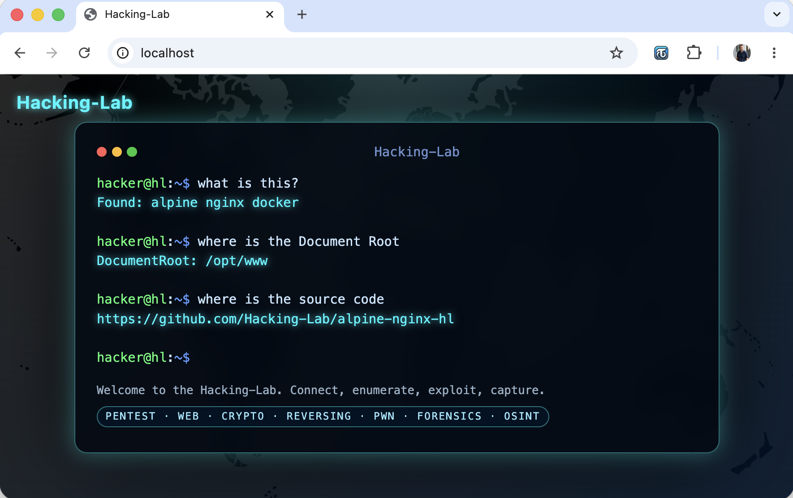

# alpine-nginx-hl
Alpine NGINX 
- static web server 
- nginx 



## Base Image
https://github.com/Hacking-Lab/alpine-base-hl

## Document Root
* `/opt/www/`

## Docker Hub
https://hub.docker.com/repository/docker/hackinglab/alpine-nginx-hl

```bash
services:
  alpine-nginx-hl:
    build: .
    image: hackinglab/alpine-nginx-hl:3.2
    environment:
    - AUTHOR=e1
    - HL_USER_USERNAME=hacker
    ports:
      - 80:80
```
